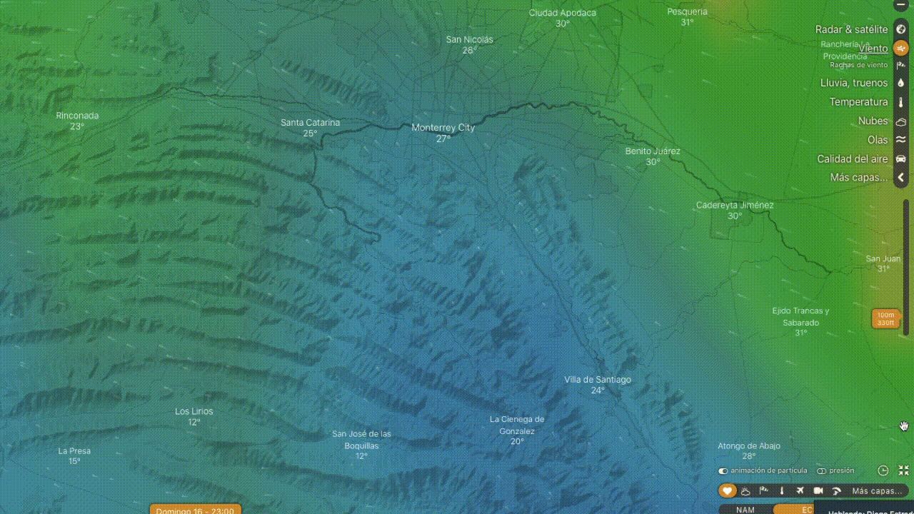

# TITULO 1
## TITULO 2
###### TITULO 6

*TEXTO EN NEGRITA*
_TEXTO EN CURSIVA_
_ESTOS DOS SE **PUEDEN** COMBINAR_

* Así
* Se 
* Pueden
* Hacer 
* Listas

[Facebook de Javier](https://www.facebook.com/javiervargasreyes)

Con el signo de mayor que
>Se pueden hacer citas

Tabla 1 | Tabla 2
--------|---------
Contenido izq | Contenido der
Contenido | Contenidos

PRUEBA

PRUEBA

PRUEBA

